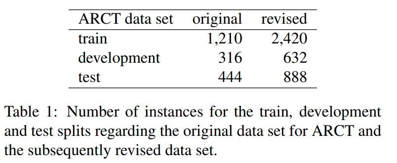
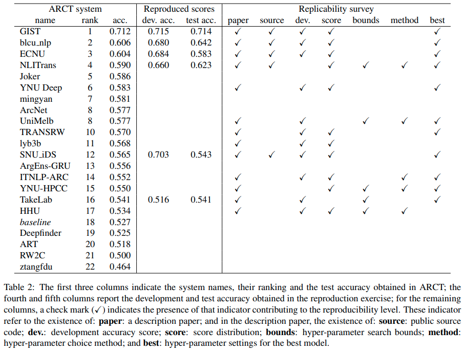
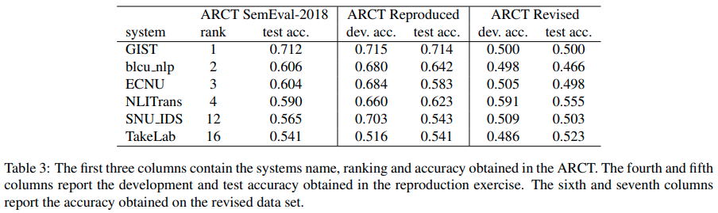

# Reproduction and Revival of the Argument Reasoning Comprehension Task

## Article

**Authors**
```
Rodrigues, João António, Ruben Branco, João Ricardo Silva, António Branco
```

**Paper**

[Reproduction and Revival of the Argument Reasoning Comprehension Task]()


**Abstract**
> Reproduction of scientific findings is essential for scientific development across all scientific disciplines and reproducing results of previous works is a basic requirement for validating the hypothesis and conclusions put forward by them.
This paper reports on the scientific reproduction of several systems addressing the Argument Reasoning Comprehension Task of SemEval2018.  
Given a recent publication that pointed out spurious statistical cues in the data set used in the shared task, and that produced a revised version of it, we also evaluated the reproduced systems with this new data set.
The exercise reported here shows that, in general, the reproduction of these systems is successful with scores in line with those reported in SemEval2018. However, the performance scores are worst than those, and even below the random baseline, when the reproduced systems are run over the revised data set expunged from data artifacts. This demonstrates that this task is actually a much harder challenge than what could have been perceived from the inflated, close to human-level performance scores obtained with the data set used in SemEval2018.  This calls for a revival of this task as there is much room for improvement until systems may come close to the upper bound provided by human performance.

## Data sets

Argument Reasoning Comprehension Task [[Paper]](https://www.aclweb.org/anthology/S18-1121/) [[Data set]](https://github.com/habernal/semeval2018-task12)

Probing Neural Network Comprehension of Natural Language Arguments [[Paper]](https://www.aclweb.org/anthology/P19-1459/) [[Revised Data set]](https://github.com/IKMLab/arct2)

## Data & Results

The original data set was split into 1,210 training instances, 316 development instances and 444 test instances, the revised data set was split into 2,420 training instances, 632 development instances and 888 test instances as presented in Table 1.

The ranking and scores of the systems submitted to the ARCT task are presented in Table 2.
A survey of the description papers and how they stand concerning the reproducibility indicators is also presented in Table 2.

The results from the re-evaluation of the six systems reproduced with the revised data set are presented in Table 3.
 








## System reports


For each reproduction attempt, a report with technical details can be found at:


* [Gist](reports/gist.md)

* [blcu_nlp](reports/blcu_nlp.md)

* [ECNU](reports/ecnu.md)

* [NLITrans](reports/nlitrans.md)

* [SNU_IDS](reports/snu_ids.md)

* [TakeLab](reports/takelab.md)


